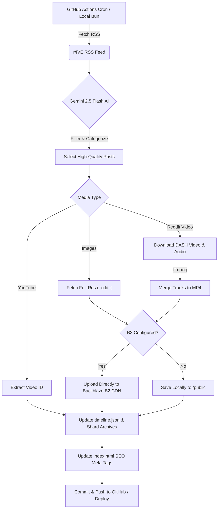

# 🌊 Dive with IVE

[](https://divewithive.com)
[]()
[]()
[]()
[]()
[]()

**Dive with IVE** is an autonomous, AI-curated digital sanctuary and news aggregator for the K-pop group **IVE**. Built to showcase premium media layouts, buttery-smooth animations, and custom video experiences, the platform updates automatically every 4 hours using an intelligent scraping agent powered by Google Gemini 2.5 Flash.

---

## ✨ Key Features

### 🤖 Autonomous AI Curation (`agent.js`)
* **Intelligent Filtering:** Powered by **Google Gemini 2.5 Flash**, the automated agent filters out low-effort posts, fan chatter, and duplicates, selecting only high-quality updates (comebacks, pictorials, ambassador news, concert previews).
* **Smart Categorization:** Automatically assigns custom tags (`Tour`, `Award`, `Member`, `Fansite`, `Release`) with tailored UI styling.
* **Dynamic SEO Enrichment:** Automatically injects the latest headline, description, and cover image into `index.html` OpenGraph and Twitter meta tags for flawless social sharing.

### ☁️ Cloud Object Storage & Scalability
* **Direct Backblaze B2 CDN Integration:** Uses the AWS S3 SDK to upload all high-resolution images and merged MP4 videos directly to Backblaze B2 cloud storage, serving media globally via lightning-fast CDN endpoints.
* **Graceful Local Fallback:** Automatically detects if B2 environment variables are missing or incomplete and seamlessly reverts to saving media to the local filesystem, ensuring zero friction during local development.
* **Static JSON Sharding:** Automatically monitors `timeline.json` growth; when entries exceed 500 items, older news is automatically archived into monthly sharded files (`src/data/archive/timeline-YYYY-MM.json`) to keep initial page load speeds instantaneous.

### 🎬 Advanced Media Processing
* **Multi-Proxy Reddit Scraper:** Bypasses CDN restrictions and 403 blocks using a rotating multi-proxy JSON scraper.
* **Automated Audio/Video Merging:** Detects separated Reddit DASH video and audio streams, downloading and merging them locally via `ffmpeg` before cloud upload to ensure pristine video playback with fully synchronized sound.
* **Full-Resolution Image Upgrading:** Automatically rewrites preview URLs to fetch and store uncompressed, full-resolution images from `i.redd.it`.

### 💎 Premium Frontend UI/UX
* **Custom Video Player:** Built from scratch with auto-mute detection, custom volume controls, and intuitive "Tap to Unmute" mobile overlays.
* **Interactive Lightbox Gallery:**: Features seamless fade transitions, zero layout jank, and synchronized thumbnail navigation.
* **Vinyl Music Player:** An interactive discography experience with a spinning vinyl record, absolute-positioned info panels, and smooth playback toggles.
* **Framer Motion Integration:** Fluid layout animations (`AnimatePresence`), spring-physics hover states, and smooth timeline filtering by idol member or platform.

---

## 🏗️ Architecture & Automated Workflow

Every 4 hours, a GitHub Actions cron job triggers the automated workflow:



---

## 🚀 Getting Started (Local Development)

### Prerequisites
* **Node.js** (v20+) or **Bun** (v1.1+)
* **FFmpeg** installed and available in your system PATH (for local video/audio merging)

### 1. Clone the Repository
```bash
git clone https://github.com/azshen23/divewithive.com.git
cd divewithive
```

### 2. Install Dependencies
```bash
npm install
# or with bun
bun install
```

### 3. Environment Variables
Create a `.env` file in the root directory and add your API keys and Backblaze B2 credentials:
```env
# Gemini AI (Required)
GEMINI_API_KEY=your_gemini_api_key_here

# Backblaze B2 Cloud Storage (Optional — will fall back to local storage if omitted)
B2_ENDPOINT=s3.us-east-005.backblazeb2.com
B2_REGION=us-east-005
B2_KEY_ID=your_b2_key_id
B2_APPLICATION_KEY=your_b2_application_key
B2_BUCKET_NAME=divewithive-media
B2_PUBLIC_URL=https://f005.backblazeb2.com/file/divewithive-media
```

### 4. Run the Frontend Dev Server
```bash
npm run dev
# or with bun
bun run dev
```
Your application will be running at `http://localhost:5173`.

### 5. Run the AI Scraping Agent Locally
To manually trigger the scraping, S3 cloud upload, and AI curation process:
```bash
npm run agent
# or with bun
bun agent
```

---

## 📁 Project Structure

```text
divewithive/
├── .github/workflows/
│   └── daily-agent.yml      # Automated 4-hour scraping cron job
├── src/
│   ├── components/          # Modular React components (Hero, Timeline, VideoPlayer, etc.)
│   ├── data/
│   │   ├── archive/         # Monthly sharded timeline JSON archives
│   │   └── timeline.json    # Main AI-generated news database (capped at 500 entries)
│   ├── App.tsx              # Main application view & layout assembly
│   ├── index.css            # Tailwind CSS & custom utilities
│   └── main.tsx             # React DOM entry point
├── agent.js                 # Autonomous AI scraping, S3 upload, & sharding script
├── tailwind.config.js       # Tailwind configuration & custom fonts/colors
└── vite.config.ts           # Vite bundler configuration
```

---

## 🛠️ Tech Stack

* **Core:** React 18, TypeScript, Vite
* **Styling & UI:** Tailwind CSS, Framer Motion, Lucide React
* **AI & Scraping:** Google Gemini 2.5 Flash API, RSS2JSON, Multi-Proxy Fetch
* **Cloud Storage:** Backblaze B2 Object Storage, `@aws-sdk/client-s3`
* **Media Processing:** FFmpeg (child_process/execSync)
* **Automation & DevOps:** GitHub Actions, Vercel Analytics, Husky, Lint-Staged

---

## 📄 License

This project is private and created for experimental, educational, and K-pop community enjoyment purposes. All scraped media assets and K-pop group trademarks belong to their respective copyright holders (Starship Entertainment, etc.).
